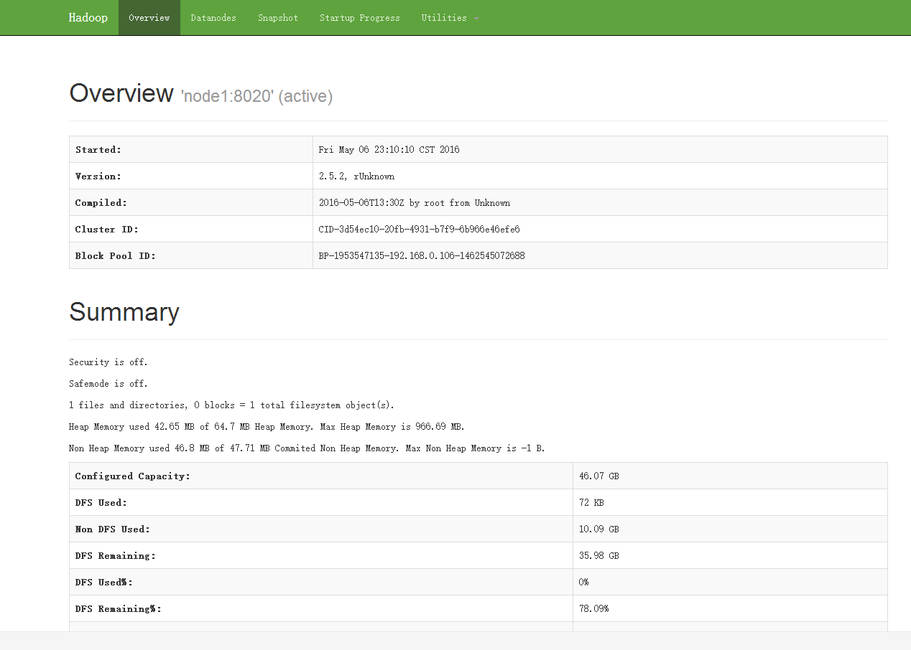
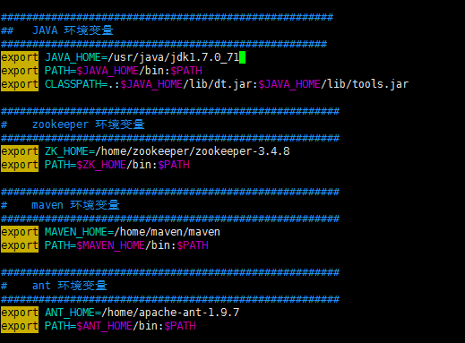
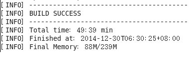
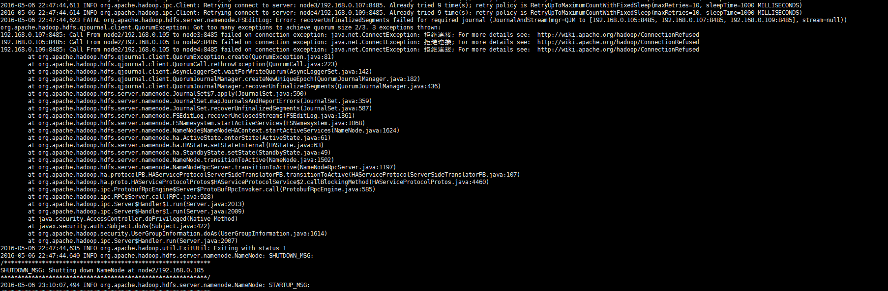

# 一、hadoop 的安装  以2.5.2为例
### 1. 服务器列表

node  | NN  | DN  |ZK  | ZKFC | JN  | RM | DM 
---   | --- | --- | ---| -----| --- | ---| ---
node1 | 1   |     | 1  |   1  |     | 1  |    
node2 | 1   | 1   | 1  |   1  |  1  |    | 1  
node3 |     | 1   | 1  |      |  1  |    | 1  
node4 |     | 1   |    |      |  1  |    | 1  
	
### 2. 安装hadoop [hadoop官网](http://hadoop.apache.org/docs/r2.5.2/hadoop-project-dist/hadoop-hdfs/HDFSHighAvailabilityWithQJM.html) 配置

1) 下载 hadoop-2.5.2.tar.gz 压缩包 并解压到/home/hadoop/下边 
2) 编辑 hdfs-site.xml 添加一些配置
	
	<property>
	  <name>dfs.nameservices</name>
	  <value>mycluster</value>
	</property>
	
	//配置高可用的两个节点
	<property>
	  <name>dfs.ha.namenodes.mycluster</name>
	  <value>nn1,nn2</value>
	</property>
	
	//配置两台机器的rpc协议端口
	<property>
	  <name>dfs.namenode.rpc-address.mycluster.nn1</name>
	  <value>machine1.example.com:8020</value>
	</property>
	<property>
	  <name>dfs.namenode.rpc-address.mycluster.nn2</name>
	  <value>machine2.example.com:8020</value>
	</property>
	
	//配置两台机器的http协议端口
	<property>
	  <name>dfs.namenode.http-address.mycluster.nn1</name>
	  <value>machine1.example.com:50070</value>
	</property>
	<property>
	  <name>dfs.namenode.http-address.mycluster.nn2</name>
	  <value>machine2.example.com:50070</value>
	</property>
	
	//配置一组JN的连接地址 用来供namenode 读/写
	<property>
	  <name>dfs.namenode.shared.edits.dir</name>
	  <value>qjournal://node1.example.com:8485;node2.example.com:8485;node3.example.com:8485/mycluster</value>
	</property>
	
	//HDFS Java类客户端 ，用来连接活跃的namenode
	<property>
	  <name>dfs.client.failover.proxy.provider.mycluster</name>
	  <value>org.apache.hadoop.hdfs.server.namenode.ha.ConfiguredFailoverProxyProvider</value>
	</property>
	
	//需要故障转移的时候 连接活跃namenode 的方式  这里是 SSH方式
	<property>
	  <name>dfs.ha.fencing.methods</name>
	  <value>sshfence</value>
	</property>
	//配置SSH连接的私钥 
	<property>
	  <name>dfs.ha.fencing.ssh.private-key-files</name>
	  <value>/home/exampleuser/.ssh/id_rsa</value>
	</property>
	
	//配置JN的数据存放目录
	<property>
	  <name>dfs.journalnode.edits.dir</name>
	  <value>/path/to/journal/node/local/data</value>
	</property>
	//配置namenode自动切换
	<property>
	   <name>dfs.ha.automatic-failover.enabled</name>
	   <value>true</value>
	 </property>

3)编辑 core-site.xml 添加一些配置
	
	//配置默认的namenode
	<property>
	  <name>fs.defaultFS</name>
	  <value>hdfs://mycluster</value>
	</property>
	
	//配置zookeeper 集群的连接
	<property>
	   <name>ha.zookeeper.quorum</name>
	   <value>zk1.example.com:2181,zk2.example.com:2181,zk3.example.com:2181</value>
	 </property>
	 
	//配置hadoop的数据存储目录（系统默认是在linux服务的一个临时目录下，重启后就会消失）
	<property>
	   <name>hadoop.tmp.dir</name>
	   <value>/home/hadoop</value>
	 </property>
	
4)编辑 slaves 添加datanode节点的名称

	node2
	node3
	node4
	
5)编辑 hadoop-env.sh 添加JAVA_HOME的环境变量
	
	export JAVA_HOME=/usr/java/jdk1.8.0_65
	
### 3.启动
	
1)首先启动 三个节点的journalNode 
	
	./hadoop-daemon.sh start journalnode 
	
2)两个nameNode中随便选一个 格式化
	
	./hdfs namenode -format
	
3)同步另一个nameNode的数据

	./hadoop-daemon.sh start namenode   //启动的namenode为已经格式化的节点
	./hdfs namenode -bootstrapStandby   //在未格式化的节点上执行该命令
	
4)初始化高可用的状态到zookeeper
	
	./hdfs zkfc -formatZK     //随意一台namenode节点上执行该命令  zookeeper集群必须是已启动状态
	
5)停掉zookeeper以为的所有服务  再启动所有服务

	./stop-dfs.sh
	./start-dfs.sh 
	
	
6)使用linux jps命令查看各个进程是否正常  并在浏览器中访问namenode

	[root@node2 ~]# jps
	2178 DataNode
	2242 JournalNode
	2118 NameNode
	1516 QuorumPeerMain
	2445 Jps
	2303 DFSZKFailoverController
	
	看见以下图片代表成功了	

### 4.问题

一、使用官网上直接下载的hadoop-2.5.2.tar.gz（32位的） 安装后会有很多报错 所以需要自己重新下载源码包 在 64位的机器上进行编译

1.环境
	
* 64位linux系统。我使用的是 CentOS
* JDK 1.7+。注：使用1.7即可，如果是1.8则会编译失败
* maven-3.3.9。 这是apache的一个产品，hadoop的编译要就是3.0以上
* protobuf-2.5.0
* hadoop-2.5.2-src 这个可以到Apache的官网上去下载
* ant-1.9.7

2.环境安装简单介绍

* 安装JDK 并配置环境变量
* 安装maven 并配置环境变量
* 安装protobuf

		安装protobuf前需要安装一些东西
		yum  install  gcc    安装c++
	  	yum  install  gcc-c++          然后会两次提示输入 y（yes/no）
	  	yum install  make          可能会提示因为make已经是最新版本，而不会安装，这个无所谓，反正是最新版本，就不安装了
	  	
	  	tar -zxvf protobuf-2.5.0.tar.gz
		
		cd  /protobuf-2.5.0
		./configrue
		make
		make  install
		测试  
		protoc  --version

* 安装CMake

	yum  install  cmake     
    yum  install  openssl-devel
    yum  install  ncurses-devel

* ant 安装 配置环境变量

	
	 source /etc/profile

3.编译hadoop
	
	tar -zxvf hadoop-2.5.2-src.tar.gz
	cd /root/hadoop-2.5.2-src/
    cd hadoop-2.5.2-src
	mvn package -Pdist,native -DskipTests -Dtar
	
	编译完成后会有提示，SUCCESS /

4.编译结果
	
	hadoop-dist/target/hadoop-2.5.2.tar.gz  就是刚刚编译好的64位hadoop包 
	
5.总结
	
	整个编译过程需要很长时间， 需要耐心等待！ 
	
二、配置完成后启动时会报错，并且两个namenode节点，会停掉  错误信息如下图

1.原因

	NameNode作为JournalNode的客户端发起连接请求，但是失败了，然后NameNode又向其他节点依次发起了请求都失败了，直至到了最大重试次数。
	
	NameNode启动时JournalNode必须是已经启动状态，但是在启动时 先启动了namenode ,再启动journalnode,在journalnode启动好之前，
	namenode这时已经达到了最大重试次数，所以最终失败了。
	
2.解决方案

	修改core-site.xml中的ipc参数
	
	<property>
	   <name>ipc.client.connect.max.retries</name>
	   <value>100</value>
	   <description>Indicates the number of retries a client will make to establish
	       a server connection.
	   </description>
	 </property>
	 <property>
	   <name>ipc.client.connect.retry.interval</name>
	   <value>10000</value>
	   <description>Indicates the number of milliseconds a client will wait for
	  before retrying to establish a server connection.
	   </description>
	 </property>
