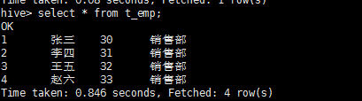

# hive的基本操作

###	一、createtable

*	首先看例句

		CREATE TABLE page_view(
			viewTime INT, 
			userid BIGINT,
		 	page_url STRING, 
		 	referrer_url STRING,
		 	ip STRING COMMENT 'IP Address of the User'
		 )
		COMMENT 'This is the page view table'
		PARTITIONED BY (ip	string)
		ROW FORMAT DELIMITED FIELDS TERMINATED BY '\001'
		STORED AS TEXTFILE;
		
		create table t_emp(
			id int,
			name	string,
			age		int,
			dept_name	string
		)
		ROW FORMAT DELIMITED FIELDS TERMINATED BY ','
		STORED AS TEXTFILE;
		
		create table dept_acount(
			dname	string,
			int num
		)
		
		CREATE EXTERNAL TABLE page_view(
			viewTime INT, 
			userid BIGINT,
     		page_url STRING, 
     		referrer_url STRING,
     		ip STRING COMMENT ,
     		country STRING 
		)
		ROW FORMAT DELIMITED FIELDS TERMINATED BY '\054'
		STORED AS TEXTFILE
		LOCATION '<hdfs_location>';
		
		create table t_person(
			id	int,
			name	string,
			like	array<string>,
			feature		map<string,string>
		)
		ROW FORMAT DELIMITED FIELDS TERMINATED BY ','
		COLLECTION ITEMS TERMINATED BY '_'  --集合分割符
		MAP KEYS TERMINATED BY ':';			 --MAP key和value分割符
		
		//数据格式
		1,zhangsan,sports_books_TV,sex:男_color:red

*	CREATETABLE 创建一个指定名字的表。如果相同名字的表已经存在，则抛出异常；用户可以用 IF NOT EXIST 选项来忽略这个异常

*	EXTERNAL关键字可以让用户创建一个外部表，在建表的同时指定一个指向实际数据的路径（LOCATION）.
	Hive 创建内部表时，会将数据移动到数据仓库指向的路径；若创建外部表，仅记录数据所在的路径，不对数据的位置做任何改变。
	在删除表的时候，内部表的元数据和数据会被一起删除，而外部表只删除元数据，不删除数据。
	
*	LIKE 允许用户复制现有的表结构，但是不复制数据。

*	（SerDe 是Serialize/Deserilize的简称，目的是用于序列化和反序列化）
	用户在建表的时候可以自定义 SerDe 或者使用自带的 SerDe。
	如果没有指定 ROW FORMAT 或者 ROW FORMAT DELIMITED，将会使用自带的 SerDe。
	在建表的时候，用户还需要为表指定列，用户在指定表的列的同时也会指定自定义的SerDe，Hive 通过 SerDe 确定表的具体的列的数据。
	
* 	如果文件数据是纯文本，可以使用 STORED AS TEXTFILE。如果数据需要压缩，使用 STORED AS SEQUENCE

*	有分区的表可以在创建的时候使用 PARTITIONED BY 语句。
	一个表可以拥有一个或者多个分区，每一个分区单独存在一个目录下。
	而且，表和分区都可以对某个列进行 CLUSTERED BY 操作，将若干个列放入一个桶（bucket）中。
	也可以利用SORT BY 对数据进行排序。这样可以为特定应用提高性能
	
*	表名和列名不区分大小写，SerDe 和属性名区分大小写。表和列的注释是字符串。

*	分区表实际是一个文件夹，表名即文件夹名，每个分区，实际是表名这个文件夹下面的不同文件。
	分区可以根据时间、地点等等进行划分。

*	terminated by：关于来源的文本数据的字段间隔符
	如果要将自定义间隔符的文件读入一个表，需要通过创建表的语句来指明输入文件间隔符，然后load data到这个表。
	PARTITIONED BY:是根据那个字段进行分区
	
###	 二、删除table

* drop table
	
		DROP TABLE [IF EXISTS] table_name ;	

* Truncate Table
	
		TRUNCATE TABLE table_name [PARTITION partition_spec];
		
		partition_spec:
		: (partition_column = partition_col_value, partition_column = partition_col_value, ...)	
		
	
### 三、导入数据

#### load data

+ 语法

		load data [local] inpath 'filepath' into table table_name [partition (partcol1=val1, partcol2=val2 ...)]

+ 例句
		
		把/root目录下的t_emp.txt文件内容导入到 t_emp表中
		
		load data local inpath '/root/t_emp.txt' into table t_emp;

#### Inserting data into Hive Tables from queries

+ 语法

		INSERT INTO TABLE tablename1 [PARTITION (partcol1=val1, partcol2=val2 ...)] select_statement1 FROM from_statement;
		
+ 例句
	
		insert into table dept_acount select dept_name,count(1) from t_emp group by dept_name;

###	 四、常用语句

		show databases;  -- 列出所有数据库
		use database_name; --选择一个数据库
		show tables;		--列出该数据库下的所有表
		desc table_name; --查看表结构
		select * from table_name;  --查询该表中的所有数据  (只有查询所有数据的时候  不会执行mapreduce)
		drop table table_name;
	
	

		
		
	