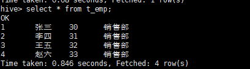

# 一、hive安装 1.2.1 
	
1.官网上下载 apache-hive-1.2.1-bin.tar.gz 并解压到/home/hive目录下

2.因为hive是基于hadoop的数据仓库，所以必须配置hadoop环境变量 

	export HADOOP_HOME=/home/hadoop/hadoop-2.5.2
	export PATH=$HADOOP_HOME/bin:$PATH
	export PATH=$HADOOP_HOME/sbin:$PATH
	
3.进入到bin目录下  执行 ./hive 启动

4.hive需要连接关系型数据库   以 MySQL为例 配置

1)copy hive-default.xml.template 并改名为 hive-site.xml 并编辑 添加MySQL配置    hive 默认使用derby数据库，
	直接修改以下三项就可以

	<property>
	    <name>javax.jdo.option.ConnectionURL</name>
	    <value>jdbc:mysql://node3/hive</value>
	    <description>JDBC connect string for a JDBC metastore</description>
	</property>
	<property>
	    <name>javax.jdo.option.ConnectionUserName</name>
	    <value>root</value>
	    <description>Username to use against metastore database</description>
	</property>
	<property>
	    <name>javax.jdo.option.ConnectionPassword</name>
	    <value>shiyanlei</value>
	    <description>password to use against metastore database</description>
	</property>

2)下载MySQL驱动包 mysql-connector-java-5.1.38.jar 添加到 hive/lib/ 目录下

# 二、问题

1.执行./hive 时 可能会报错

	[root@node1 bin]# ./hive

	Logging initialized using configuration in jar:file:/home/hive/lib/hive-common-1.2.1.jar!/hive-log4j.properties
	[ERROR] Terminal initialization failed; falling back to unsupported
	java.lang.IncompatibleClassChangeError: Found class jline.Terminal, but interface was expected
		at jline.TerminalFactory.create(TerminalFactory.java:101)
		at jline.TerminalFactory.get(TerminalFactory.java:158)
		at jline.console.ConsoleReader.<init>(ConsoleReader.java:229)
		at jline.console.ConsoleReader.<init>(ConsoleReader.java:221)
		at jline.console.ConsoleReader.<init>(ConsoleReader.java:209)
		at org.apache.hadoop.hive.cli.CliDriver.setupConsoleReader(CliDriver.java:787)
		at org.apache.hadoop.hive.cli.CliDriver.executeDriver(CliDriver.java:721)
		at org.apache.hadoop.hive.cli.CliDriver.run(CliDriver.java:681)
		at org.apache.hadoop.hive.cli.CliDriver.main(CliDriver.java:621)
		at sun.reflect.NativeMethodAccessorImpl.invoke0(Native Method)
		at sun.reflect.NativeMethodAccessorImpl.invoke(NativeMethodAccessorImpl.java:62)
		at sun.reflect.DelegatingMethodAccessorImpl.invoke(DelegatingMethodAccessorImpl.java:43)
		at java.lang.reflect.Method.invoke(Method.java:497)
		at org.apache.hadoop.util.RunJar.main(RunJar.java:212)
	
	Exception in thread "main" java.lang.IncompatibleClassChangeError: Found class jline.Terminal, but interface was expected
		at jline.console.ConsoleReader.<init>(ConsoleReader.java:230)
		at jline.console.ConsoleReader.<init>(ConsoleReader.java:221)
		at jline.console.ConsoleReader.<init>(ConsoleReader.java:209)
		at org.apache.hadoop.hive.cli.CliDriver.setupConsoleReader(CliDriver.java:787)
		at org.apache.hadoop.hive.cli.CliDriver.executeDriver(CliDriver.java:721)
		at org.apache.hadoop.hive.cli.CliDriver.run(CliDriver.java:681)
		at org.apache.hadoop.hive.cli.CliDriver.main(CliDriver.java:621)
		at sun.reflect.NativeMethodAccessorImpl.invoke0(Native Method)
		at sun.reflect.NativeMethodAccessorImpl.invoke(NativeMethodAccessorImpl.java:62)
		at sun.reflect.DelegatingMethodAccessorImpl.invoke(DelegatingMethodAccessorImpl.java:43)
		at java.lang.reflect.Method.invoke(Method.java:497)
		at org.apache.hadoop.util.RunJar.main(RunJar.java:212)
		
* 原因

	hadoop目录下存在老版本jline： 
	/hadoop-2.5.2/share/hadoop/yarn/lib： 
	-rw-r--r-- 1 root root  87325 Mar 10 18:10 jline-0.9.94.jar

* 解决：

	cp /hive/apache-hive-1.2.1-bin/lib/jline-2.12.jar /hadoop-2.5.2/share/hadoop/yarn/lib
	
2.启动./hive 报错

	[root@node1 bin]# ./hive

	Logging initialized using configuration in jar:file:/home/hive/lib/hive-common-1.2.1.jar!/hive-log4j.properties
	Exception in thread "main" java.lang.RuntimeException: java.lang.IllegalArgumentException: java.net.URISyntaxException: Relative path in absolute URI: ${system:java.io.tmpdir%7D/$%7Bsystem:user.name%7D
		at org.apache.hadoop.hive.ql.session.SessionState.start(SessionState.java:522)
		at org.apache.hadoop.hive.cli.CliDriver.run(CliDriver.java:677)
		at org.apache.hadoop.hive.cli.CliDriver.main(CliDriver.java:621)
		at sun.reflect.NativeMethodAccessorImpl.invoke0(Native Method)
		at sun.reflect.NativeMethodAccessorImpl.invoke(NativeMethodAccessorImpl.java:62)
		at sun.reflect.DelegatingMethodAccessorImpl.invoke(DelegatingMethodAccessorImpl.java:43)
		at java.lang.reflect.Method.invoke(Method.java:497)
		at org.apache.hadoop.util.RunJar.main(RunJar.java:212)
	Caused by: java.lang.IllegalArgumentException: java.net.URISyntaxException: Relative path in absolute URI: ${system:java.io.tmpdir%7D/$%7Bsystem:user.name%7D
		at org.apache.hadoop.fs.Path.initialize(Path.java:206)
		at org.apache.hadoop.fs.Path.<init>(Path.java:172)
		at org.apache.hadoop.hive.ql.session.SessionState.createSessionDirs(SessionState.java:563)
		at org.apache.hadoop.hive.ql.session.SessionState.start(SessionState.java:508)
		... 7 more
	Caused by: java.net.URISyntaxException: Relative path in absolute URI: ${system:java.io.tmpdir%7D/$%7Bsystem:user.name%7D
		at java.net.URI.checkPath(URI.java:1823)
		at java.net.URI.<init>(URI.java:745)
		at org.apach
		
* 解决方案
	
	将${system:java.io.tmpdir}，替换为/home/hive/tmp/
	
3.执行查询时报错
	
	Failed with exception java.io.IOException:java.lang.IllegalArgumentException: java.net.URISyntaxException: 
	Relative path in absolute URI: ${system:user.name%7D

* 解决方案

	把hive-site.xml文件中的${system:user.name}全部替换为一个实际的路径 
	
	保存重启 即可
	
# 三、hive的基本操作

1.	createtable

*	CREATETABLE 创建一个指定名字的表。如果相同名字的表已经存在，则抛出异常；用户可以用 IF NOT EXIST 选项来忽略这个异常

*	EXTERNAL关键字可以让用户创建一个外部表，在建表的同时指定一个指向实际数据的路径（LOCATION）.
	Hive 创建内部表时，会将数据移动到数据仓库指向的路径；若创建外部表，仅记录数据所在的路径，不对数据的位置做任何改变。
	在删除表的时候，内部表的元数据和数据会被一起删除，而外部表只删除元数据，不删除数据。
	
*	LIKE 允许用户复制现有的表结构，但是不复制数据。

*	（SerDe 是Serialize/Deserilize的简称，目的是用于序列化和反序列化）
	用户在建表的时候可以自定义 SerDe 或者使用自带的 SerDe。
	如果没有指定 ROW FORMAT 或者 ROW FORMAT DELIMITED，将会使用自带的 SerDe。
	在建表的时候，用户还需要为表指定列，用户在指定表的列的同时也会指定自定义的SerDe，Hive 通过 SerDe 确定表的具体的列的数据。
	
* 	如果文件数据是纯文本，可以使用 STORED AS TEXTFILE。如果数据需要压缩，使用 STORED AS SEQUENCE

*	有分区的表可以在创建的时候使用 PARTITIONED BY 语句。
	一个表可以拥有一个或者多个分区，每一个分区单独存在一个目录下。
	而且，表和分区都可以对某个列进行 CLUSTERED BY 操作，将若干个列放入一个桶（bucket）中。
	也可以利用SORT BY 对数据进行排序。这样可以为特定应用提高性能
	
*	表名和列名不区分大小写，SerDe 和属性名区分大小写。表和列的注释是字符串。

*	分区表实际是一个文件夹，表名即文件夹名，每个分区，实际是表名这个文件夹下面的不同文件。
	分区可以根据时间、地点等等进行划分。

*	例句
	
		CREATE TABLE page_view(
			viewTime INT, 
			userid BIGINT,
		 	page_url STRING, 
		 	referrer_url STRING,
		 	ip STRING COMMENT 'IP Address of the User'
		 )
		COMMENT 'This is the page view table'
		PARTITIONED BY (ip	string)
		ROW FORMAT DELIMITED FIELDS TERMINATED BY '\001'
		STORED AS TEXTFILE;

*	terminated by：关于来源的文本数据的字段间隔符
	如果要将自定义间隔符的文件读入一个表，需要通过创建表的语句来指明输入文件间隔符，然后load data到这个表。
	PARTITIONED BY:是根据那个字段进行分区
	
		create table t_emp(
			id int,
			name	string,
			age		int,
			dept_name	string
		)
		ROW FORMAT DELIMITED FIELDS TERMINATED BY ','
		STORED AS TEXTFILE;
		
		create table dept_acount(
			dname	string,
			int num
		)
		
	
2. 导入数据

1)load data

*	语法

		load data [local] inpath 'filepath' into table table_name [partition (partcol1=val1, partcol2=val2 ...)]

*	例句
		
		1)	把/root目录下的t_emp.txt文件内容导入到 t_emp表中
		
		load data local inpath '/root/t_emp.txt' into table t_emp;

2)Inserting data into Hive Tables from queries

* 语法

		INSERT INTO TABLE tablename1 [PARTITION (partcol1=val1, partcol2=val2 ...)] select_statement1 FROM from_statement;
		
* 例句
	
		insert into table dept_acount select dept_name,count(1) from t_emp group by dept_name;

3. 常用语句

		show databases;  -- 列出所有数据库
		use database_name; --选择一个数据库
		show tables;		--列出该数据库下的所有表
		desc table_name; --查看表结构
		
		select * from table_name;  --查询该表中的所有数据  (只有查询所有数据的时候  不会执行mapreduce)
	
	

		
#	四、 数据类型

1)数值类型(Numeric Types)

type	 | 字节数
-------  | -----
TINYINT  |	1     
SMALLINT |	2     
INT  	 |	4     
BIGINT   |	8     
FLOAT    |	4     
DOUBLE   |	8     
DECIMAL  |	 

2)日期类型(Date/Time Types)
     
type	   | 字节数
-------    | -----
TIMESTAMP  |	1     
DATE 	   |	2   

3)字符串

STRING

4)集合

ARRAY<data_type>   
MAP<primitive_type, data_type>
STRUCT<col_name : data_type [COMMENT col_comment], ...>  --相当于一个对象
UNIONTYPE<data_type, data_type, ...> 

*	例句
		
		create table t_person(
			id	int,
			name	string,
			like	array<string>,
			feature		map<string,string>
		)
		ROW FORMAT DELIMITED FIELDS TERMINATED BY ','
		COLLECTION ITEMS TERMINATED BY '_'  --集合分割符
		MAP KEYS TERMINATED BY ':';			 --MAP key和value分割符
		
		//数据格式
		1,zhangsan,sports_books_TV,sex:男_color:red
		
  	

*[hadoop](hadoop.md) 
	+[hdfs](hdfs-shell.md) 
*[mapred](mapred.md) 

	
	