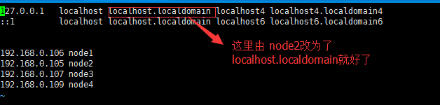

#	一、zookeeper 的安装  以3.4.8为例
###	1.单机安装
1)安装目录：/home/zookeeper/ 
2)上传压缩包 zookeeper-3.4.8.tar.gz 解压到当前目录下并改名为 zookeeper 
3)在/home/zookeeper/下创建 zk1目录 并创建data 和log目录  
4)复制/home/zookeeper/zookeeper/conf/zoo_sample.cfg 并改名为zoo.cfg 并编辑zoo.cfg 

		 tickTime=2000 Zookeeper使用的基本时间，时间单位为毫秒。它用于心跳机制，并且设置最小的
						session超时时间为两倍心跳时间
		initLimit=5        是Zookeeper用它来限定quorum中的Zookeeper服务器连接到Leader的超时时间.
					          此时该参数设置为5，说明时间限制为5倍tickTime, 即5*2000=10000ms=10s
		syncLimit=5        标识 Leader 与 Follower 之间发送消息，请求和应答时间最长时间 此时该参数设置为5, 
					         说明时间限制为5倍tickTime, 即5*2000=10000ms=10s
		dataDir=/home/zookeeper/zk1/data   数据目录. 可以是任意目录
		dataLogDir=/home/zookeeper/zk1/log   log目录, 同样可以是任意目录. 如果没有设置该参数, 
												    将使用和dataDir相同的设置
		clientPort=2181  监听client连接的端口号
5)启动 ./zkServer.sh start   
6)客户端连接  ./zkCli.sh -server ip:2181 
7)停止 ./zkServer.sh stop  
		
### 2.集群
1)在每台服务器上安装按照单机安装的方式安装 
2)编辑zoo.cfg 

	server.1=10.1.39.43:2888:3888  
	server.2=10.1.39.47:2888:3888    
	server.3=10.1.39.48:2888:3888
3)在每个dataDir目录下新建myid文件，写入一个数字, 该数字表示这是第几号server.
      	该数字必须和zoo.cfg文件中的server.X中的X一一对应
4)分别进入 每个bin目录下  ./zkServer.sh start  启动服务 
		
		
#	二、zookeeper原理
[原理](http://cailin.iteye.com/blog/2014486/)

#	三、zookeeper集群安装过程中的问题

	2016-05-03 22:47:30,781 [myid:3] - WARN  [QuorumPeer[myid=3]/0:0:0:0:0:0:0:0:2181:QuorumCnxManager@400] - Cannot open 		channel to 1 at election address node1/192.168.0.106:3888
	java.net.ConnectException: 拒绝连接
		at java.net.PlainSocketImpl.socketConnect(Native Method)
		at java.net.AbstractPlainSocketImpl.doConnect(AbstractPlainSocketImpl.java:350)
		at java.net.AbstractPlainSocketImpl.connectToAddress(AbstractPlainSocketImpl.java:206)
		at java.net.AbstractPlainSocketImpl.connect(AbstractPlainSocketImpl.java:188)
		at java.net.SocksSocketImpl.connect(SocksSocketImpl.java:392)
		at java.net.Socket.connect(Socket.java:589)
		at org.apache.zookeeper.server.quorum.QuorumCnxManager.connectOne(QuorumCnxManager.java:381)
		at org.apache.zookeeper.server.quorum.QuorumCnxManager.connectAll(QuorumCnxManager.java:426)
		at org.apache.zookeeper.server.quorum.FastLeaderElection.lookForLeader(FastLeaderElection.java:843)
		at org.apache.zookeeper.server.quorum.QuorumPeer.run(QuorumPeer.java:822)
					
解决方式：

	可以看到是连接到Node2的38888端口不通（我配置文件设置的节点端口，server.3=Node2:28888:38888），这样就找到问题了，所以当遇到问题的时候记得查看日志文件，这才是最有帮助的，而不是修改什么nc参数。
	
	查看Node2节点发现，38888端口绑带到127.0.0.1上了，这让Master节点怎么连接呀，只需修改/etc/hosts文件即可，同理，修改Node1，然后重启zookeeper，发现问题解决。

	127.0.0.1   localhost node2 localhost4 localhost4.localdomain4
	::1         localhost localhost.localdomain localhost6 localhost6.localdomain6
	
	
	192.168.0.106 node1
	192.168.0.105 node2
	192.168.0.107 node3
	192.168.0.109 node4
	

